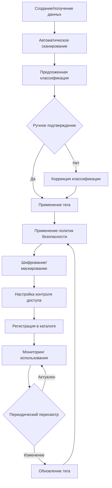

# Анализ безопасности системы «Медикаменте» — Полное решение

---

## 1. Выявление конфиденциальных данных, не учтённых в системах безопасности

### 1.1. Медицинские данные вне систем учёта

**Неструктурированные медицинские артефакты:**

- **Сканированные амбулаторные карты** в форматах PDF/JPG, хранящиеся в папках по именам пациентов
- **Ручные записи врачей** на бумажных носителях, не переведённые в электронный вид
- **Результаты инструментальных исследований** (ЭКГ, УЗИ, МРТ) в виде изображений без метаданных
- **Фотографии медицинских документов** на мобильных устройствах сотрудников

**Контекст:** Эти данные содержат диагнозы, историю болезни, назначения — информацию особой категории согласно 152-ФЗ.
Они хранятся без шифрования, классификации и контроля доступа.

### 1.2. Временные и промежуточные данные

**Операционные кэши:**

- **Excel-файлы на рабочих станциях** с выгрузками из 1С для локальной работы
- **Буфер обмена** с копиями персональных данных при ручном переносе между системами
- **Временные файлы печати** на принт-сервере с медицинскими направлениями
- **Логи приложений**, содержащие фрагменты ПДн в открытом виде

**Контекст:** Создаются в процессе работы, часто остаются неочищенными, увеличивают поверхность атаки.

### 1.3. Метаданные и структурная информация

**Косвенные идентификаторы:**

- **Иерархия папок** на сетевом диске, раскрывающая структуру отделений и диагнозы
- **Имена файлов**, содержащие ФИО, даты рождения, коды диагнозов
- **Свойства документов** (автор, дата изменения), позволяющие отследить цепочку обработки
- **Экраны мониторов** с открытыми медицинскими картами в переговорных комнатах

**Контекст:** Даже при защите содержимого файлов метаданные могут раскрыть конфиденциальную информацию.

---

## 2. Диаграммы потоков данных (DFD)

### Процесс 1: Регистрация нового пациента

[link](./diagrams/registration.puml)

### Процесс 2: Оказание медицинской услуги и документирование

[link](./diagrams/documents.puml)

### Процесс 3: Лабораторная диагностика и обработка результатов

[link](./diagrams/labs_work.puml)

### Процесс 4: Финансовые операции и бухгалтерский учёт

[link](./diagrams/fin_operations.puml)

## 3. Аудит мер безопасности и соответствие требованиям

### 3.1. Анализ соответствия 152-ФЗ «О персональные данные»

| **Статья/Требование**                                 | **Текущее состояние**                          | **Соответствие**   | **Риск**    | **Требуемые меры**                            |
|-------------------------------------------------------|------------------------------------------------|--------------------|-------------|-----------------------------------------------|
| **Статья 18.1.** Меры по обеспечению безопасности ПДн | Отсутствуют технические и организационные меры | ❌ Не соответствует | Критический | Внедрение СЗПДн, шифрование, контроль доступа |
| **Статья 19.** Уведомление Роскомнадзора              | Не подано, обработка ведётся без регистрации   | ❌ Не соответствует | Критический | Подача уведомления в течение 30 дней          |
| **Статья 21.** Обязанности оператора                  | Не определены, не документированы              | ❌ Не соответствует | Высокий     | Разработка политик и регламентов              |
| **Статья 22.2.** Контроль (надзор)                    | Внутренний контроль отсутствует                | ❌ Не соответствует | Высокий     | Назначение ответственного, внутренний аудит   |

### 3.2. Специальные требования для медицинских организаций

| **Нормативный акт**                     | **Конкретное требование**                           | **Состояние**                      | **Приоритет** | **Срок выполнения** |
|-----------------------------------------|-----------------------------------------------------|------------------------------------|---------------|---------------------|
| **ФЗ-323 «Об основах охраны здоровья»** | Статья 13. Соблюдение врачебной тайны               | Медкарты доступны всем сотрудникам | Критический   | 2 недели            |
| **Приказ Минздрава №203н**              | Ведение медицинской документации в электронном виде | Бумажные носители и сканы          | Высокий       | 3 месяца            |
| **Приказ Минздрава №29н**               | Регистры, журналы и отчётные формы                  | Excel-файлы без защиты             | Высокий       | 2 месяца            |
| **ФСТЭК России**                        | Защита информации в ИС медорганизаций               | Нет классификации, нет СЗИ         | Критический   | 1 месяц             |

### 3.3. Отраслевые стандарты и лучшие практики

| **Стандарт/Практика**    | **Требование**                                  | **Соответствие**    | **Разрыв**                             |
|--------------------------|-------------------------------------------------|---------------------|----------------------------------------|
| **ISO 27001:2022**       | Система менеджмента информационной безопасности | Отсутствует         | Полный разрыв                          |
| **PCI DSS 4.0**          | Защита данных платёжных карт                    | Не применяется      | Не актуально до внедрения онлайн-оплат |
| **HIPAA (адаптировано)** | Защита медицинской информации                   | Частичное понимание | Требует локализации                    |
| **Privacy by Design**    | Встраивание приватности в архитектуру           | Не применяется      | Концептуальный разрыв                  |

---

## 4. Список проблемных зон (полный каталог)

### Критический приоритет

| **ID**   | **Проблемная зона**                | **Описание**                                           | **Бизнес-риск**                             | **Технический риск**                             | **Срок решения** |
|----------|------------------------------------|--------------------------------------------------------|---------------------------------------------|--------------------------------------------------|------------------|
| **P0-1** | Открытое хранение медицинских карт | Сканы карт в JPG/PDF доступны всем пользователям сети  | Утрата доверия, штрафы                      | Компрометация всех медицинских данных            | 2 недели         |
| **P0-2** | Отсутствие шифрования ПДн          | Все персональные данные хранятся в открытом виде       | Нарушение 152-ФЗ, приостановка деятельности | Возможность чтения данных при физическом доступе | 1 месяц          |
| **P0-3** | Принцип «всем всё» в доступе       | Нет разграничения прав, IT-отдел имеет доступ ко всему | Инсайдерские угрозы, утечки                 | Невозможность контроля и аудита                  | 3 недели         |
| **P0-4** | Незащищённая передача данных       | OLE, TCP/IP без шифрования, email с ПДн                | Перехват данных, финансовые потери          | Пассивное и активное прослушивание               | 1 месяц          |

### Высокий приоритет

| **ID**   | **Проблемная зона**            | **Описание**                                        | **Бизнес-риск**                        | **Технический риск**                        | **Срок решения** |
|----------|--------------------------------|-----------------------------------------------------|----------------------------------------|---------------------------------------------|------------------|
| **P1-1** | Двойной учёт в Excel и 1С      | Ручное дублирование создаёт расхождения             | Ошибки в отчётности, финансовые потери | Расхождение данных, сложность синхронизации | 3 месяца         |
| **P1-2** | Отсутствие системы аудита      | Невозможно отследить доступ и изменения             | Недетерминированность при инцидентах   | Отсутствие доказательной базы               | 2 месяца         |
| **P1-3** | Бумажные носители с ПДн        | Направления, рецепты, результаты анализов на бумаге | Утеря, неавторизованный доступ         | Невозможность технического контроля         | 4 месяца         |
| **P1-4** | Нет политик управления данными | Не определены сроки хранения, порядок удаления      | Нарушение прав субъектов ПДн           | Накопление устаревших данных                | 3 месяца         |

### Средний приоритет

| **ID**   | **Проблемная зона**             | **Описание**                              | **Бизнес-риск**                    | **Технический риск**            | **Срок решения** |
|----------|---------------------------------|-------------------------------------------|------------------------------------|---------------------------------|------------------|
| **P2-1** | Отсутствие классификации данных | Нет разметки по уровню конфиденциальности | Несоразмерные меры защиты          | Сложность приоритизации защиты  | 4 месяца         |
| **P2-2** | Устаревшее ПО и протоколы       | Критические обновления не устанавливаются | Эксплуатация известных уязвимостей | Компрометация систем            | 5 месяцев        |
| **P2-3** | Нет DLP-системы                 | Нет контроля утечек через email, USB      | Необнаруженные инциденты           | Пассивное накопление угроз      | 6 месяцев        |
| **P2-4** | Слабая аутентификация           | Только пароли, нет MFA                    | Компрометация учётных записей      | Доступ к данным злоумышленников | 4 месяца         |

### Низкий приоритет

| **ID**   | **Проблемная зона**                        | **Описание**                            | **Бизнес-риск**                | **Технический риск**                      | **Срок решения** |
|----------|--------------------------------------------|-----------------------------------------|--------------------------------|-------------------------------------------|------------------|
| **P3-1** | Нет автоматического резервного копирования | Ручное копирование раз в неделю         | Потеря данных за период        | Длительное восстановление                 | 7 месяцев        |
| **P3-2** | Отсутствие тестирования на проникновение   | Нет регулярных проверок безопасности    | Необнаруженные уязвимости      | Постепенная деградация защиты             | 8 месяцев        |
| **P3-3** | Нет системы мониторинга                    | Реактивное, а не проактивное управление | Позднее обнаружение инцидентов | Накопление нерегламентированных изменений | 6 месяцев        |

---

## 5. Каталог данных для защиты и методы защиты

### Категория A: Медицинские данные особой чувствительности

| **Тип данных**            | **Местонахождение**                       | **Уровень**      | **Шифрование**                         | **Обфускация**                     | **Обезличивание**                      | **Контроль доступа**               |
|---------------------------|-------------------------------------------|------------------|----------------------------------------|------------------------------------|----------------------------------------|------------------------------------|
| **Диагнозы и заключения** | Медкарты (PDF/JPG), записи врачей         | A1 (Критический) | AES-256 при хранении, TLS при передаче | Маскирование в логах и интерфейсах | K-анонимизация (k=10) для исследований | ABAC: только лечащий врач          |
| **Результаты анализов**   | Папки пациентов, email, бумажные носители | A1 (Критический) | AES-256-GCM, PGP для email             | Токенизация ссылок                 | L-диверсификация для аналитики         | RBAC: врач + пациент (только свои) |
| **История болезни**       | Медкарты, Excel-журналы                   | A1 (Критический) | Прозрачное шифрование БД               | Псевдонимизация в тестовых средах  | Дифференциальная приватность           | ABAC: временные ограничения        |
| **Назначения и рецепты**  | Бумажные бланки, сканы                    | A2 (Высокий)     | Шифрование на уровне файловой системы  | Маскирование серийных номеров      | Агрегация для отчётности               | RBAC: врач + фармацевт             |

### Категория B: Персональные идентифицирующие данные

| **Тип данных**           | **Местонахождение**            | **Уровень**  | **Шифрование**             | **Обфускация**                 | **Обезличивание**                        | **Контроль доступа**                    |
|--------------------------|--------------------------------|--------------|----------------------------|--------------------------------|------------------------------------------|-----------------------------------------|
| **ФИО, дата рождения**   | Excel-базы, папки, 1С          | B1 (Высокий) | AES-256 в БД, TDE          | Маскирование: "Иван И."        | Замена на UUID во внутренних системах    | RBAC: минимально необходимый доступ     |
| **Паспортные данные**    | Сканы в папках, бумажные копии | B1 (Высокий) | Шифрование + водяные знаки | Показ только последних 4 цифр  | Не применяется (требуется для договоров) | RBAC: ресепшен, бухгалтерия             |
| **Контактные данные**    | Excel, email, бумажные журналы | B2 (Средний) | Шифрование в REST API      | Маскирование телефонов и email | Хеширование для аналитики                | RBAC: сотрудники с необходимостью связи |
| **Адреса, места работы** | Анкеты, договоры               | B2 (Средний) | Шифрование полей БД        | Обобщение: "Москва, ЦАО"       | Географическая агрегация                 | RBAC: ограниченный круг                 |

### Категория C: Финансовые и операционные данные

| **Тип данных**                 | **Местонахождение**           | **Уровень**  | **Шифрование**                | **Обфускация**    | **Обезличивание**        | **Контроль доступа**       |
|--------------------------------|-------------------------------|--------------|-------------------------------|-------------------|--------------------------|----------------------------|
| **Платёжные реквизиты**        | Чеки ККМ, платёжные поручения | C1 (Высокий) | PCI DSS-совместимое           | Tokenization      | Не применяется           | RBAC: кассиры, бухгалтеры  |
| **Данные договоров**           | Бумага, сканы, 1С             | C2 (Средний) | Шифрование вложений           | Маскирование сумм | Агрегация для аналитики  | RBAC: юристы, бухгалтеры   |
| **Учётные данные сотрудников** | 1С, Active Directory          | C1 (Высокий) | Хеширование паролей, MFA      | Не применяется    | Не применяется           | Привилегированный доступ   |
| **Данные поставщиков**         | Договоры, 1С:Торговля         | C3 (Низкий)  | Шифрование коммерческой тайны | Маскирование цен  | Агрегация для отчётности | RBAC: закупки, бухгалтерия |

---

## 6. Система тегирования данных

### 6.1. Многоуровневая система классификации

**Уровень 1: Конфиденциальность (CL)**

- `CL-PUBLIC` — Публичные данные (пресс-релизы, вакансии)
- `CL-INTERNAL` — Внутренние данные (расписания, политики)
- `CL-CONFIDENTIAL` — Конфиденциальные данные (операционная информация)
- `CL-RESTRICTED` — Ограниченные данные (ПДн, финансы)
- `CL-SECRET` — Секретные данные (медицинские диагнозы, результаты анализов)

**Уровень 2: Категория данных (DC)**

- `DC-PII` — Персональные идентифицирующие данные
- `DC-PHI` — Защищённая медицинская информация
- `DC-FIN` — Финансовые данные
- `DC-OPER` — Операционные данные
- `DC-LEGAL` — Юридические документы

**Уровень 3: Юрисдикция и регулятивные требования (JR)**

- `JR-RU-152FZ` — Требования 152-ФЗ (РФ)
- `JR-RU-323FZ` — Требования ФЗ-323 (медицинская тайна)
- `JR-PCI-DSS` — Требования PCI DSS
- `JR-GDPR` — GDPR (для иностранных пациентов)
- `JR-HIPAA` — HIPAA (для международных партнёров)

**Уровень 4: Статус обработки (PS)**

- `PS-RAW` — Исходные, необработанные данные
- `PS-CLEANSED` — Очищенные, верифицированные данные
- `PS-ANONYMIZED` — Обезличенные данные
- `PS-AGGREGATED` — Агрегированные данные
- `PS-ARCHIVED` — Архивные данные

### 6.2. Формат тега и примеры

**Структура тега:** `[CL]-[DC]-[JR]-[PS]-[RETENTION]-[OWNER]`

**Примеры:**

- `CL-SECRET-DC-PHI-JR-RU-323FZ-PS-RAW-RET-25Y-OWNER-DR-IVANOV`
    - Секретные медицинские данные, требования врачебной тайны, исходные, хранение 25 лет, владелец — врач Иванов
- `CL-RESTRICTED-DC-PII-JR-RU-152FZ-PS-CLEANSED-RET-5Y-OWNER-RECEPTION`
    - Ограниченные ПДн, требования 152-ФЗ, очищенные, хранение 5 лет, владелец — ресепшен
- `CL-CONFIDENTIAL-DC-FIN-JR-PCI-DSS-PS-AGGREGATED-RET-3Y-OWNER-ACCOUNTING`
    - Конфиденциальные финансовые данные, требования PCI DSS, агрегированные, хранение 3 года, владелец — бухгалтерия

### 6.3. Инструменты тегирования

| **Инструмент**            | **Тип данных**           | **Способ применения**                     | **Интеграция**                   |
|---------------------------|--------------------------|-------------------------------------------|----------------------------------|
| **Apache Atlas**          | Data Lake, БД            | Автоматическое тегирование по политикам   | Hadoop, Hive, Kafka, PostgreSQL  |
| **Microsoft Purview**     | Гибрид (Cloud+On-prem)   | Сканирование и классификация              | Azure, SQL Server, Office 365    |
| **Collibra Data Catalog** | Корпоративные данные     | Бизнес-глоссарии + технические метаданные | REST API, JDBC, файловые системы |
| **OpenMetadata**          | Open-source альтернатива | Полный стек метаданных                    | Docker, Kubernetes, Airflow      |
| **Собственное решение**   | Специфические требования | Java/Python + БД метаданных               | Любые системы через API          |

### 6.4. Процесс жизненного цикла тегов



---

## 7. Архитектура мер и инструментов безопасности

### 7.1. Комплексная система защиты данных

```
Уровень 7: Бизнес-процессы и политики
├── Политика информационной безопасности
├── Регламенты работы с ПДн
├── Обучение и аттестация сотрудников
└── Процедуры реагирования на инциденты

Уровень 6: Прикладной уровень
├── RBAC/ABAC системы контроля доступа
├── Шифрование на уровне приложения
├── Маскирование данных в UI
└── Аудит всех операций

Уровень 5: Уровень данных
├── Шифрование данных (TDE, Column-level)
├── Классификация и тегирование
├── DLP системы
└── Data Loss Prevention

Уровень 4: Уровень СУБД
├── Transparent Data Encryption
├── Database Activity Monitoring
├── Маскирование в тестовых средах
└── Резервное копирование с шифрованием

Уровень 3: Операционная система
├── Шифрование дисков (BitLocker/LUKS)
├── Mandatory Access Control
├── Антивирусная защита
└── Host-based IDS

Уровень 2: Сетевой уровень
├── Сегментация сети (медицинская/офисная/гостевая)
├── Firewall + IDS/IPS
├── VPN для удалённого доступа
└── TLS для всех соединений

Уровень 1: Физический уровень
├── Контроль доступа в серверную
├── Видеонаблюдение
├── Защита от перехвата электромагнитного излучения
└── Резервное электропитание
```

### 7.2. Матрица выбора инструментов

| **Задача защиты**                  | **Приоритет** | **Инструменты**                                   | **Срок внедрения** | **Оценка эффективности**                       |
|------------------------------------|---------------|---------------------------------------------------|--------------------|------------------------------------------------|
| **Шифрование данных при хранении** | Критический   | BitLocker (Windows), LUKS (Linux), VeraCrypt      | 1 месяц            | 95% снижение риска при компрометации носителей |
| **Защита передаваемых данных**     | Критический   | TLS 1.3, IPSec VPN, WireGuard                     | 1 месяц            | 100% защищённых каналов                        |
| **Контроль доступа**               | Критический   | Keycloak (IAM), Active Directory, OpenPolicyAgent | 2 месяца           | Устранение принципа "всем всё"                 |
| **Аудит и мониторинг**             | Высокий       | ELK Stack, Wazuh, Grafana                         | 2 месяца           | 100% отслеживаемость операций                  |
| **Предотвращение утечек**          | Высокий       | Microsoft Purview DLP, OpenDLP                    | 3 месяца           | Обнаружение 90% попыток утечки                 |
| **Классификация данных**           | Средний       | Apache Atlas, собственное решение                 | 4 месяца           | Автоматическая классификация 80% данных        |
| **Резервное копирование**          | Средний       | Veeam, Bacula, BorgBackup                         | 3 месяца           | RTO < 4 часа, RPO < 24 часа                    |
| **Тестирование безопасности**      | Низкий        | Nessus, OpenVAS, OWASP ZAP                        | 6 месяцев          | Ежеквартальные проверки                        |

### 7.3. План поэтапного внедрения

**Фаза 1: Экстренные меры (0-1 месяц)**

1. Установка BitLocker на все серверы и рабочие станции
2. Ограничение доступа к папкам с медицинскими картами
3. Внедрение политики сложных паролей
4. Начало ведения журнала инцидентов

**Фаза 2: Базовые меры (1-3 месяца)**

1. Внедрение TLS для всех внутренних сервисов
2. Настройка базового RBAC в Active Directory
3. Развёртывание ELK для централизованного логирования
4. Разработка политики информационной безопасности

**Фаза 3: Продвинутые меры (3-6 месяцев)**

1. Внедрение системы классификации и тегирования
2. Настройка DLP системы
3. Миграция критических данных в защищённые БД
4. Внедрение многофакторной аутентификации

**Фаза 4: Оптимизация (6-12 месяцев)**

1. Автоматизация политик безопасности
2. Внедрение SIEM системы
3. Регулярные тесты на проникновение
4. Сертификация по отраслевым стандартам

---

## 8. Доработанные DFD с мерами защиты

### Процесс 1: Регистрация пациента (To-Be)

[link](diagrams/to_be/registration.puml)

### Процесс 2: Медицинский приём (To-Be)

[link](./diagrams/to_be/labs_work.puml)
